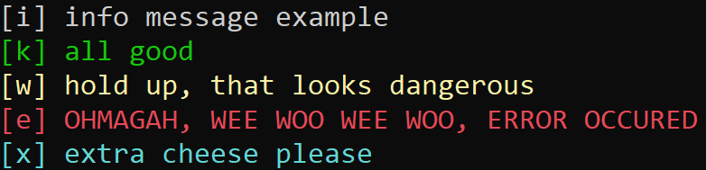

# PyLog
simple logger for python

## quick start
just download pylog.py and include it in your project!

## example
```python
import pylog
pylog.set_log_file("example.log")
pylog.info("info message example")
pylog.okay("all good", to_file=True)
pylog.warning("hold up, that looks dangerous", to_file=True)
pylog.error("OHMAGAH, WEE WOO WEE WOO, ERROR OCCURED", to_file=True)
pylog.extra("extra cheese please")
```
will look like this in the terminal:

and produce the following log file:
```text
2025-03-14 03:14:15: [k] all good
2025-03-14 03:14:15: [w] hold up, that looks dangerous
2025-03-14 03:14:15: [e] OHMAGAH, WEE WOO WEE WOO, ERROR OCCURED
```
datetime format:
```
year-month-day hours:minutes:seconds
YYYY-MM-DD HH:MM:SS
```